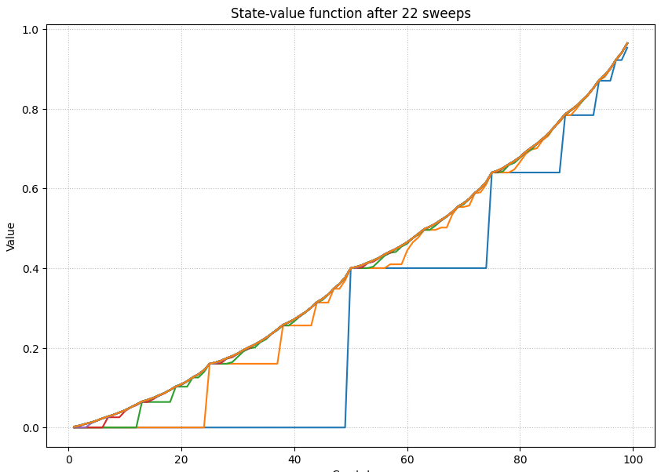
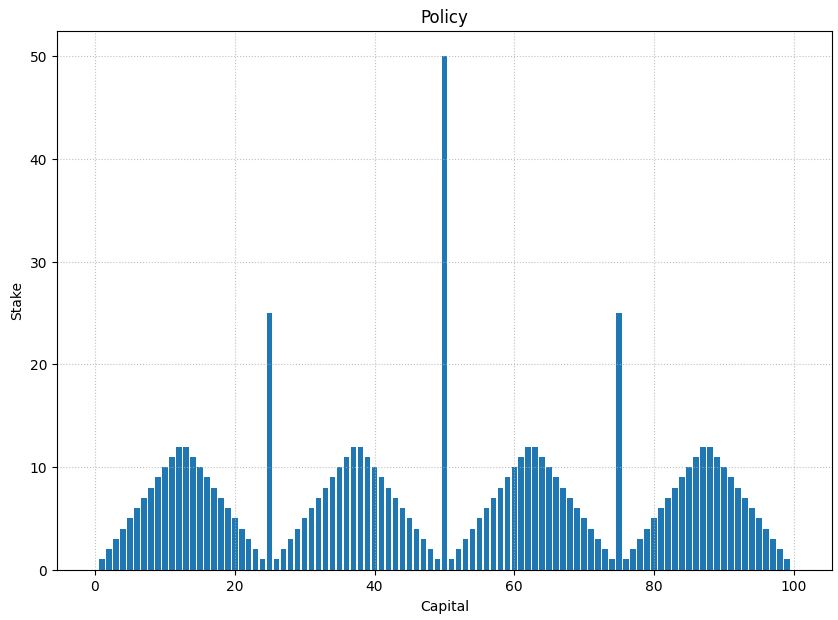

# Gambler's Problem
This task implements the Gambler's Problem as described in Sutton & Barto's book *Reinforcement Learning: An Introduction*. The goal is to find the optimal policy for a gambler who bets on the outcome of coin flips in a finite Markov Decision Process (MDP) using the Value Iteration algorithm.

## Problem Description

A gambler has the opportunity to make bets on a series of coin flips:
- If the coin lands on **heads**, the gambler wins as many dollars as they staked.
- If the coin lands on **tails**, the gambler loses their stake.

The game ends when:
1. The gambler reaches a goal of **$100**.
2. The gambler runs out of money.

The state is defined as the gambler's capital `s` (`1 <= s <= 99`), and the action space is the stakes `a` (`0 <= a <= min(s, 100-s)`). The reward is `+1` when the goal is reached, and `0` otherwise.

The **objective** is to find the optimal policy π(s) that maximizes the probability of reaching the goal.

## Value Iteration Algorithm

The Value Iteration algorithm is used to solve this problem by iteratively improving the value function until convergence. The Bellman Optimality Equation is used to update the value function.

## Results

The implementation of the Gambler's Problem using value iteration produces the following results:

### 1. State-Value Function
The graph below shows the state-value function \( V(s) \) after 22 sweeps of the value iteration algorithm. The x-axis represents the gambler's capital, and the y-axis represents the value of each state. The value function converges as the number of iterations increases.

### 2. Optimal Policy
The graph below displays the optimal policy \( \pi(s) \), which indicates the optimal bet (stake) for each state (capital). The x-axis represents the gambler's capital, and the y-axis represents the corresponding stake. Peaks represent the most optimal betting strategies to maximize the probability of reaching the goal.

